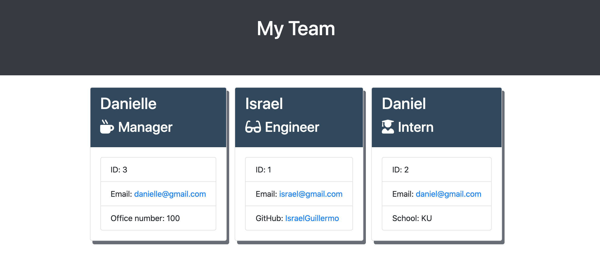

# Team Profile Generator

## Table of Contents

- [Description](#desciption)
- [Installation](#installation)
- [Usage](#Usage)
- [Contribution](#Contribution)
- [Test](#test)
- [License](#license)

## Description

This project is a backend program which allows the user to generate a profile for their team. This program is written using Node CLI. The program is designed for a manager to input the names, employee ID, email and school(for interns) or Github IDs(for engineers).
 
This tool helps managers manage their team by listing this information. The program then generates an HTML page with the information which is submitted by the manager. The program also uses NPM Inquirer to prompt information and ask for employee information which includes email, id, office number, school, Github and email.

## License

 
MIT

## Installation

npm i

## Usage

1. Open integrated Terminal 2. Run app.js file 3. Select the type of employee to be added 4. Answer prompted questions 5. System will generate HTML 6. Open HTML file to verify information submitted

## Contribution

No contribution is being accepted at this time.

## Test

None

## For any additional questions please contact me at:

Email: israelguillermo22@gmail.com
 
GitHub: [IsraelGuillermo](https://github.com/IsraelGuillermo)
